# Blast-Off - A modern alternative to hangman

This interactive front-end website has been developed to entertain space-enthusiasts whilst helping to grow and develop their space-related vocabulary through a challenging word-based game.

Blast-off is a modern twist on the good old fashioned, pen and paper based game Hangman.  Instead of slowly bringing an innocent stick-man to his untimely death by hanging, the user is challenged to guess a space-related word, letter-by-letter.  If the word is guessed correctly the rocket will blast-off into space, but if they get the answer wrong or run out of lives, the rocket will remain grounded.

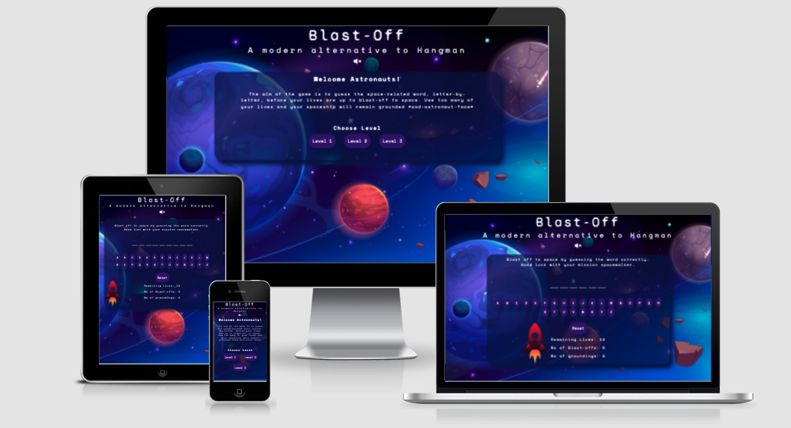

Link to deployed site:
<br>
[Blast-Off - A Modern Alternative to Hangman](https://shellied.github.io/Blast-Off/)


## UX - User Experience Design
----
### The Strategy Plane
----
#### Initial Concept

This project has been developed as part of the [Code Institute's](https://codeinstitute.net/) Diploma in Full-Stack Software Development.  The aim is to create a game that will demonstrate the skills I have learnt in HTML, CSS and Javascript

My idea for this game was to create an alternative version of the traditional pen-and-paper based game Hangman.  This game was to be based on space, and use space-themed vocabulary and include a fun animation of a rocket that would 'Blast-Off' if the user guessed the word correctly, or wobbled and toppled over if the user used all lives and did not guess the word correctly.  I wanted to create a site that could fit on one screen, despite the device used, be intuitive to use and have a fun, retro feel about it.  

The target audience is children from age 6 upwards, however it is suitable for all, with families being able to sit together to play whilst testing their spelling and increasing their space-related vocabulary.  This game could also be used in schools for topic related work and provides an opportunity for learning i.e. spelling, researching the meaning of the words generated if unknown etc.

The game could be easily adapted to fit a range of themes by simply changing the random words to be guessed, the HTML content and the colors, images and vectograms used. 

#### Site Goals

* To provide a fun, interactive game that is simple to use.
* To provide a game with varying levels of difficulty. 
* To provide options for the user to toggle sound effects on and off as they wish, where the sound is muted by default.
* To provide a fully responsive game for all device types.
* To provide an opportunity for learning.

#### User Stories

The site's strategy is based on satisfying the below user stories:

As a user:-

* I want the purpose of the game to be apparent.
* I want the game to be easy to navigate.
* I want the game to be aesthetically pleasing and styled relevant to the nature of the game.
* I want to be able to control the sound, which I would like to be muted by default.
* I would like to be able to select the difficulty level of the game.
* I want the controls to be easy to use and intuitive.
* I want to be able to keep score of the games I win and lose.
* I want to be able to reset the game.
* I want the game to be challenging.
* I want the game to have an element of fun.
* I want to be able to use the game on a wide range of devices.
* I want to be able to use a screen reader, if I need to, to help me play the game. 

### The Scope Plane
----

Features which must be included:

* Instructions on how to play the game which are easy to find and understand.
* Three levels of difficulty - easy/well-known words used for level one and more difficult/obscure words for level three and something in between for level two.
* The game should fit the viewport of the device and no scrolling should be required.
* There should be an option to reset the game board if the user wishes to start again.
* There should be a set amount of lives to make the game more challenging.
* Increment the correct answers and the incorrect answers so the user can keep track of how many games won/lost.
* The aesthetics of the game should be visually appealing and consistent with the space theme of the game.

Features that should be included:

* There should be an animation when the user wins or loses a game to make the game more fun to play.
* There should be sound effects to alert the user when a correct or incorrect letter has been picked and when the rocket takes off, or fails to take off.
* There should be a toggle button to allow the user turn sounds on and off as desired.  This should be visible at all times throughout the game.

Features that would be nice to have:

* Display the definition or facts about the correctly guessed word to provide a learning opportunity for the user.
* A button to generate a hint to help the user the guess more difficult words.

### The Structure Plane
----

With the target audience being children from age 6 up, the structure needs to be kept simple and easy to use.   

The idea is for the entire game to fit within the device viewport, so no scrolling is necessary.  

Javascript will be used to manipulate the DOM and insert the relevant HTML into the main container div depending on what buttons are pressed. 

The website will have a main landing page which when first loaded, will contain a welcome message, a brief outline of the rules of play and three buttons to select either Level One, Level Two or Level Three. 

Once a level is selected the inner HTML of the container will be replaced with the game area content.  The user will be able to use the letter buttons to guess letter that may be in the word and once the game is won or lost, the inner HTML will again be replaced with a win or lose message.   This cycle will continue until the user decides to stop play.


### The Skeleton Plane
----

#### Wireframes

The below mockups were made using Balsamiq.  The design is simple but effective.  

Mobile Wireframes

<details>
<summary>Mobile Wireframes</summary>
<br>

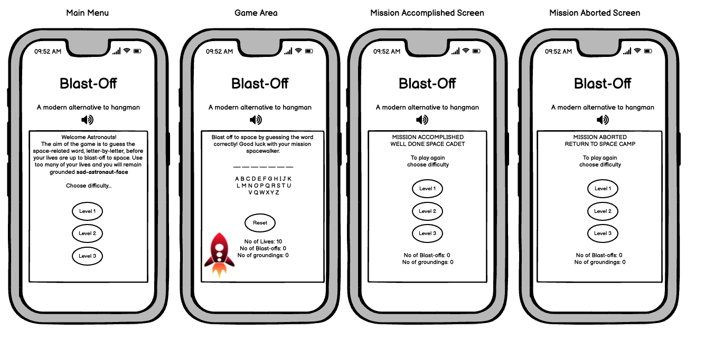
</details>

<br>

<details>
<summary>Desktop Wireframes</summary>
<br>
Desktop Wireframes
<br>

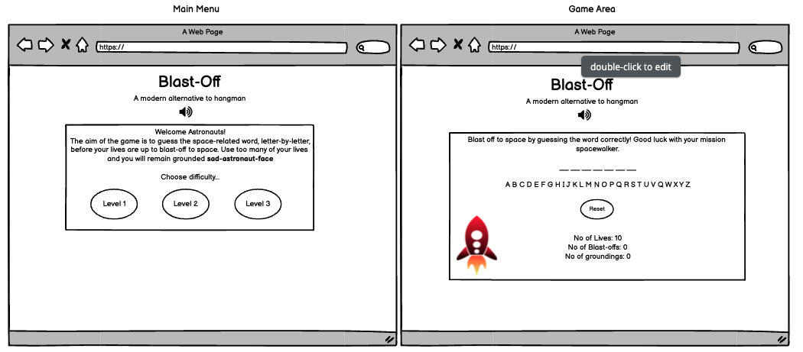
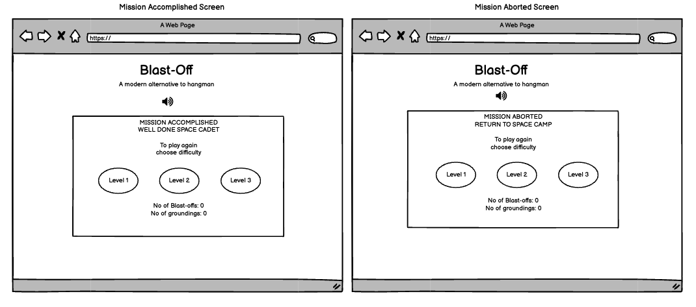
</details>

<br>

### The Surface Plane
----
#### Imagery

Once satisfied with the layout and structure of the site, I got to work on sourcing a background image that would be striking, pleasing on the eye and would connect the user to the theme of the game. The below background image was found on freepik.com and was created by [Vectorpouch](https://www.freepik.com/vectorpouch).  As soon as I saw this background, I knew I had to use it as it was almost exactly what I was envisaged when thinking about the overall look and feel of the game.  

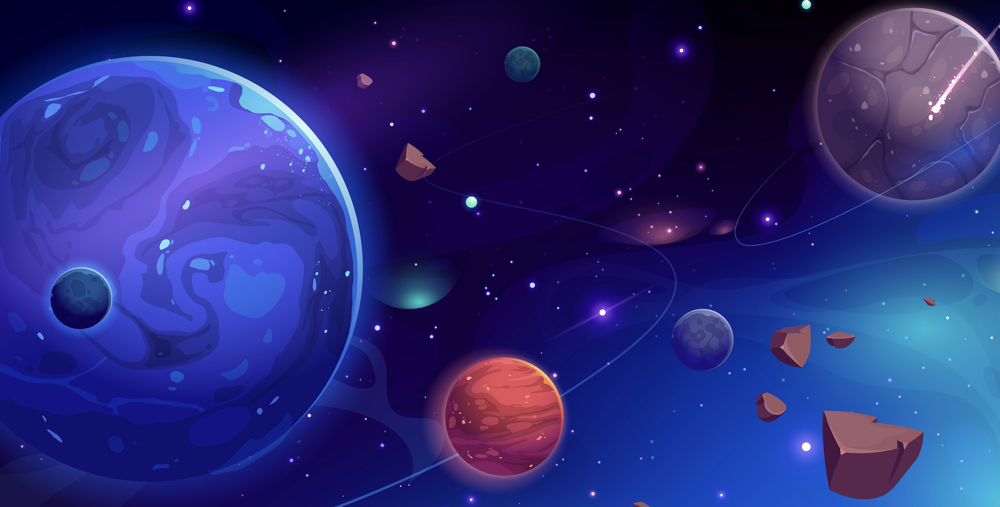

After the background was sorted, I searched for a cartoon rocket vectogram that would compliment the background-image.  I wanted something relatively simple and sourced the below vectogram from [Dawny-Dawn from Pixabay](https://pixabay.com/users/dawnydawny-2157612/?utm_source=link-attribution&amp;utm_medium=referral&amp;utm_campaign=image&amp;utm_content=2442125/)

<br>


#### Color Scheme

I wanted to keep the color scheme simple and so opted for plain white text to set a high colour contrast for accessability best practice and used [imagecolorpicker.com](https://imagecolorpicker.com/) to pull colours from the background image.  I chose a deep blue background colour to use for the main container div on the page, a shade of deep purple for all buttons and a lighter purple to create differentiation when buttons are hovered over.

I used [EightShapes Contrast Grid](https://contrast-grid.eightshapes.com) to ensure that all text and background combinations used met the required contrast ratios in compliance with [WCAG 2.0 minimum contrast](https://www.w3.org/TR/UNDERSTANDING-WCAG20/visual-audio-contrast-contrast.html).

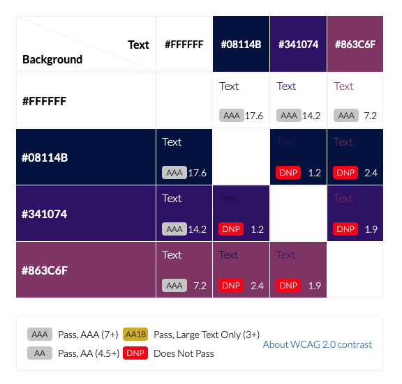

#### Typography

I wanted to give the game a science-fiction feel and what better to do that with monospaced fonts.  I used 'Space Mono' for the main body text and buttons throughout the site and for the page heading I used Syne Mono, which gives a nod towards the 90's American science fiction drama 'The X Files'.  (Moulder and Skully would be proud!) Both were sourced from [Google Fonts](https://fonts.google.com/)

In the below screenshot, you can see how both fonts pair really nicely together.

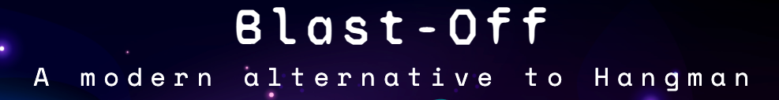

### Features

#### Existing Features
The main heading and tag line ensure that the users who are already familiar with 'hangman' will know they have landed on a game page.  See above image under 'Typography'.

Directly underneath the heading is a sound toggle button which will change to show the user whether the sound is on or off.  By default the sounds are set to mute to provide a good user experience (no one wants to be caught out whilst playing games at work!). 

The heading, tagline and sound toggle button are always visible on the screen so the user knows which website they have visited and can toggle the sound at any given point in the game.

<br>

Sound Muted: 

<br>

 

Sound Un-muted: 

<br>


<br>

For users who are unfamiliar with hangman, there is a brief outline of the rules, which are simple and easy to understand.

<br>

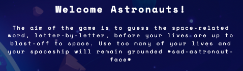

Underneath the rules there are buttons to allow the user to select the difficulty of the level at the start of the game.  These same buttons are also present on the 'Mission Accomplished' screen when a user has won a game, and the 'Mission Aborted' screen when a user has lost a game.  This provides really nice consistency across all parts of the game.  The user does not have to go searching for ways to change the levels at any point as they are displayed on all screens with the exception of the game screen.

<br>
 
 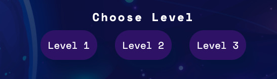

 <br>

 When the user selects a level the HTML in the container is replaced with the game screen.  The game screen contains:-

 * Another brief description of the rules.  
 * Words of encouragement for the player.
 * A hidden word, the length of which is indicated by a dashed line for each letter in the word.
 * Letter buttons, which change colour when hovered over and disappear when chosen to prevent them being chosen again. 
 * A counter to show how many remaining lives are left.  The counter decreases by one each time an incorrect letter is guessed and each game starts with 10 lives.
 * A counter to show how many 'Blast-Offs' (games won) they have achieved and similarly a counter to show how many 'Groundings' (games lost).  On the first game, these are set to zero to show no games yet won or lost.
 * A reset button that will restart the game from the beginning, hiding any correctly guessed letters again and reshowing any letter buttons that have been hidden - NOTE: this does not generate a new word, but simply allows the user to restart guessing the same word.  In hindsight, I think generating a new word here from the same difficulty level may have been better.
 * A vectogram of a rocket.  This is animated when a game is won or lost.  If the former, the rocket will blast off the page, if the latter, it wobbles, and topples over.

 If the sounds are on, the follow events will trigger sounds effects:-

 * Choosing a correct letter will trigger a coin-collect type sound.
 * Choosing an incorrect letter will trigger a bubble pop type sound (which ties in nicely with the letter button disappearing - almost popping away).
 * When the rocket blasts off, a take-off type sound is triggered.
 * When the rocket is grounded, an engine power-down sound will be triggered.

 <br>

 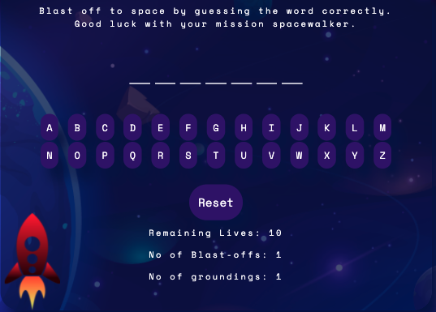

<br>

Once a game is won or lost and the animation has ended, the HTML in the container is then replaced either with the 'Mission Accomplished' message or the 'Mission Aborted' message.  The difficulty buttons are displayed again, and the user is able to select which level they would like to play next.  Blast-off/Grounding scores are incremented accordingly to allow the user to keep track of how well (or how awfully) they are playing.

<br>

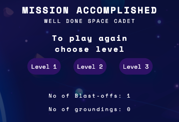

<br>

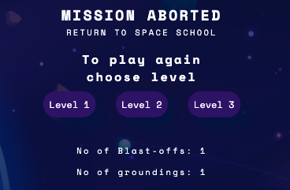

<br>


#### Features Left to Implement

Overall I think the game functions really well, is simple to use and is enjoyable to play.  However, I would like to revisit this website in the future to implement the below features.

1. Hint button - this would be added to the game area so that if the user is struggling to guess the word, they can click the hint button and the definition of the word would be shown.  

2. Difficulty Levels - I would like to make levels two and three more difficult by decreases the amount of lives they get when they start the game.  For example 8 lives for a level two game, and five lives for a level three game. 

3. It would be really nice to have a range of themes for this game, for example dinosaurs, volcanos, habitats, etc. and the main landing page would allow you to select which themed game you would like to play before asking you to select a level.

## Technologies Used. 

* HTML
* CSS
* JavaScript

## Testing

Testing has taken place continuously throughout the development of the website.  Every small section of the Javascript was tested regularly using console.logs to ensure the expected outcome was achieved.  When the outcome produced was not as expected, debugging was undertaken at that point.  I have detailed below some of the bugs that have been resolved and some that remain (due to time constraints/knowledge gaps).

### Bugs

#### Resolved Bugs

* The function to check whether the word has been guessed correctly works by comparing the number of letters in the random word generated (currentWord - the word to be guessed) against the number of letters being pushed into a new array called chosenLetters.  The new array takes only letters that are included in the currentWord so once both words have the same number of letters, the game is won.  However I noticed that after winning a game and starting a new game, the game could be won in only a few guesses, even if not all of the letters have been guessed.  At first I thought this could have been because incorrect letters were getting pushed to the chosenLetters array, but on further inspection, it was a much more simple fix and merely needed to redeclare the chosenLetters array as an empty array in the missionAccomplished and missionAborted functions so that the array was empty, ready for the next game.

* Another issue I came across during the build process was when a random word generated for guessing contained two words, for example Aurora Borealis.  The below code block would no longer work and the game could never be won:-

```
if (currentWord.length === chosenLetters.length) {
	incrementScore();
	let letterButtons = document.getElementsByClassName('letter');
	for (let letterButton of letterButtons) {
		letterButton.style.visibility = 'hidden';
	}
    document.getElementById('rocket').classList.add('animation');
	setTimeout(missionAccomplished, 3500);
}
```

There were two ways around this.  I could either remove all of the double-word answers from the array(!) OR, I could go about solving the problem.  I opted for the latter and it proved to again be an easy fix whereby I needed to check if the currentWord included a space and if so, compare the length of the currentWord -1 to the length of chosenLetters array.  If this was the case, then the below code block would run instead:-

```
if (currentWord.includes(' ')) {
	if (currentWord.length - 1 === chosenLetters.length) {
		incrementScore();
		let letterButtons = document.getElementsByClassName('letter');
		for (let letterButton of letterButtons) {
			letterButton.style.visibility = 'hidden';
		}
		document.getElementById('rocket').classList.add('animation');
		setTimeout(missionAccomplished, 3500);
    }
}
```
To be sure this code would work for all words, I checked through the levelOneWords, levelTwoWords and levelThreeWords arrays to check that there were no words that contained more than one space or possibly a hyphen, which could cause further issues.  Thankfully there were none and this would be something something to consider if I wanted to update the words lists in the future.  A new 'if statement' may be required if hyphenated or triple word answers were inserted into the word arrays at a later date.


* The main issue that raised it's ugly head during testing was that on some browsers, if you highlight the hidden word, you can actually see it and therefore cheat your way to a win (although you'd only really be cheating yourself!). My personal laptop is a Macbook Pro and I did not experience this issue when testing using the following browsers:-

- Chrome
- Mozilla
- Edge
- Safari

And as you can see from the below screen snippet, the word is hidden even when highlighted.

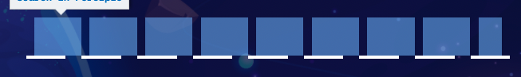

However, when using the following browsers on a microsoft computer (tested by a friend), the issue is very real:-

- Chrome
- Mozilla
- Edge

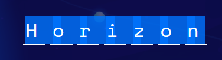

I deliberated over whether it should remain as a liveable bug as I didn't have a huge amount of time to look into ways to fix this.  I have instead applied a work-around which sets the font-size to the hidden-letters to 0px.  Whilst this may not be the best way around the issue, it did resolve it and now the word cannot be seen by inadvertently highlighting over it in any browsers.

#### Known Issues / Unresolved Bugs

* One difficulty I found was trying to make the game fully responsive on smaller screen-widths.  This was mainly due to some of the words being very long, or being long double words.  For example, 'centrifugal force' would push itself out of the container and off the screen due to the length of the word, meaning some letters could not be seen.   Unfortunately I was unaware of this until the end of the build and have not had sufficient time to fix this issue properly.  Adding an 'if statement' to the setRandomWord function to change the styling if the word is longer than 12 letters would be a good fix. However for the time being I have simply added a flex-flow: wrap; styling property to the wordArea for screen sizes 375px and smaller so any letters that would have been pushed off the screen now fall onto a line below.  All letters can now be seen, however a long single word would be split over two lines rather than one.  Whilst this is not a perfect fix, I think it is better to see the whole word, even is spread over two lines than for it to disappear off the edge of the screen.  The screenshot below demonstrates this issue:-

<br>

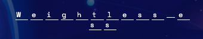

<br>

#### Validator Tests

I have loaded the website into the W3C Validators for HTML and CSS and no errors were found.    

* W3C Validator Testing - HTML [View Report](https://validator.w3.org/nu/?doc=https%3A%2F%2Fshellied.github.io%2FBlast-Off%2F/) 

<br>

* W3C Validator Testing - CSS [View Report](https://jigsaw.w3.org/css-validator/validator?uri=https%3A%2F%2Fshellied.github.io%2FBlast-Off%2F&profile=css3svg&usermedium=all&warning=1&vextwarning=&lang=en/)

<br>

I also loaded the website into Wave to produce an accessibility report.  No errors were found.  There were some warnings the regarding the audio, however as the audio that is preloaded in the HTML is only sound effects, no transcription is required, so these warnings require no action.

* Wave Accessibility Report - [View Report](https://wave.webaim.org/report#/https://shellied.github.io/Blast-Off/)


* [JSHint](https://jshint.com/) - I have loaded the JavaScript file into the linter and the following metrics and warnings were produced:-

 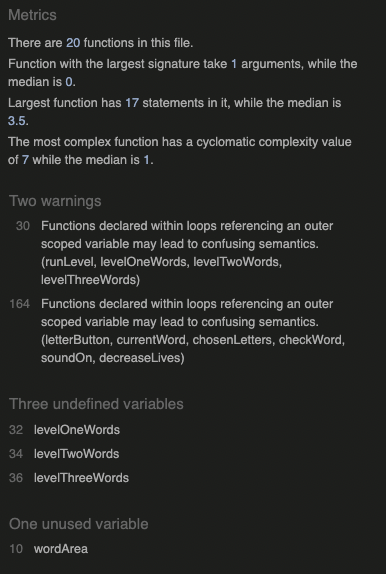

 The warnings indicate that it could be better to declare variables within the functions themselves, however I think this could cause the code to become verbose and I have therefore chosen to use  descriptive names to declare the variables and have provided docstrings to provide clear context for the functions.  This should prevent any confusing semantics.

 <br>

 The undefined variables refer to variables that are defined in the separate data.js file.  These are the long list of space related words for each level of the game: levelOneWords, levelTwoWords and levelThreeWords.   I felt it better to keep these separate from the main code as there were so many of them and would provide better organisation. 

 <br> 

 Following testing in the linter, the unused variable 'wordArea' has now been removed from the script.js file. 
 
 <br>

* Lighthouse - I used Lighthouse in Chrome Dev Tools to test the Performance, Accessibility, Best Practices and SEO scores of the site for both desktop and mobile.  The scores were perfect for desktop devices, and slightly under on performance at 94 for mobile.  

<br> 

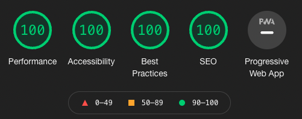

<br>

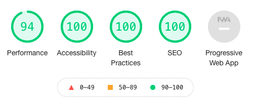

One of the reasons for the performance score being slightly lower for mobiles was the size of the files being transferred.  The background image I noticed was circa 2.7MB in size so I decided to use [TinyPNG](https://tinypng.com/) to compress the image and [CloudConvert](https://cloudconvert.com/) to convert the image from PNG to webp format.  The image was reduced to 196KB and once replaced in the CSS file, the following Lighthouse scores were produced showing a marginal improvement:-

<br>

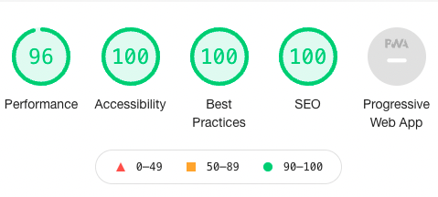

<br>

I have regularly tested all aspects of the games functionality including all buttons, animations, sounds and responsiveness during the build process and have used Dev Tools in Chrome for responsivity across the following devices:-

* Galaxy S5
* Pixel 3
* Pixel 2 XL
* iPhone 5/SE
* iPhone 6/7/8
* iPhone 6/7/8 Plus
* iPhone X
* iPhone 11 Pro
* iPad
* iPad Pro
* Surface Due
* Galaxy Fold
* Nest Hub
* Nest Hub Max

I have also tested the site physically on the below devices:

* iPhone 13 pro
* iPhone 11 Pro
* Mac Book Pro 
* Dell Latitude 5310 (Laptop)

I have also regularly tested the site using the following browsers:-

* Chrome
* Safari
* Firefox
* Edge

## Deployment

 This site was deployed to GitHub pages.  The steps taken to deploy the site are as follows:

 * In the GitHub repository, select the settings menu
 * Choose the pages tab on the left hand side menu
 * From the source section drop-down menu, select the 'Main' branch
 * Once the page has automatically refreshed, the link to the successfully deployed page will be displayed.

Live link found here:  [Blast-Off](https://shellied.github.io/Blast-Off/)

<br>

## Credits

### Reference Material

* [W3 Schools](https://www.w3schools.com/) - A valuable resource for consolidating what I had already learned and finding out more about HTML,CSS & Javascript. 
* [StackOverflow](https://stackoverflow.com/) - Generally a good resource for finding answers to problems I was having that other coders had similar experiences of.
* [Google](http://google.com) - need I say more?!
* [FreeFormatter.com](https://www.freeformatter.com/) - I used the HTML, CSS and JavaScript Beautifiers to format the code and remove any unnecessary white space.
* [TinyPNG](https://tinypng.com/) - For compressing the size of the background image.
* [CloudConvert](https://cloudconvert.com/) - To convert the background image from PNG to webp format.

### Media

* [Favicon.io](https://favicon.io/favicon-generator/) - For generating the little rocket favicon.
* [Vectorpouch](https://www.freepik.com/vectorpouch) - Thank you for the awesome background image!
* [Dawny-Dawn from Pixabay](https://pixabay.com/users/dawnydawny-2157612/?utm_source=link-attribution&amp;utm_medium=referral&amp;utm_campaign=image&amp;utm_content=2442125/) - Thanks for the rocket Vectogram.
* [ZapSplat](https://www.zapsplat.com/) -  Thank you for all the sound effects.

### Acknowledgments

* A massive thank you to Dave Horrocks for his patience and insight and for spending hours listening to me trying to make sense of JavaScript, no matter what time it was!
* Thank you also to Matt Bodden and John McPherson for their help with bugs and fixes.
* The brilliant Slack community for their encouragement, motivation and assistance.
* My mentor Brian O'Hare for his feedback and support.