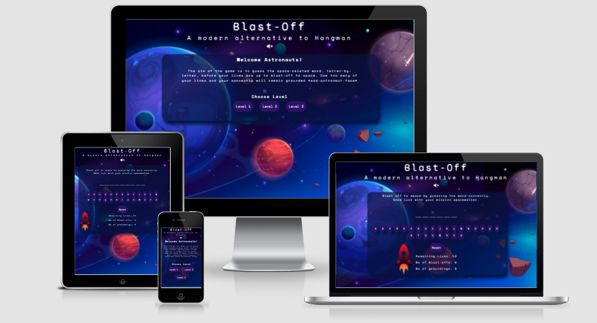
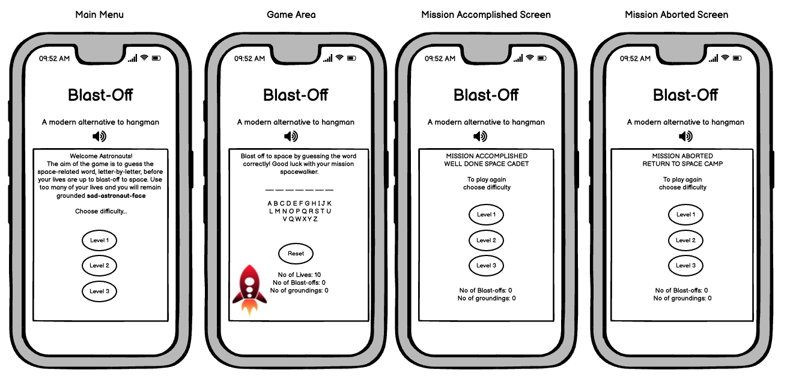
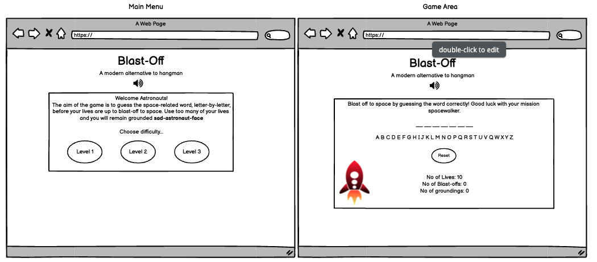
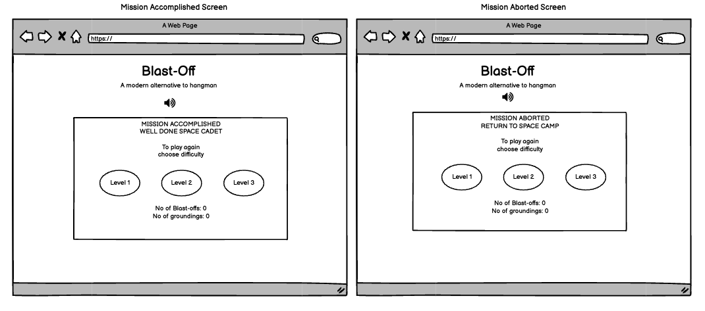
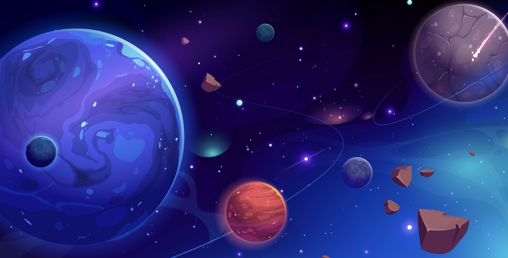
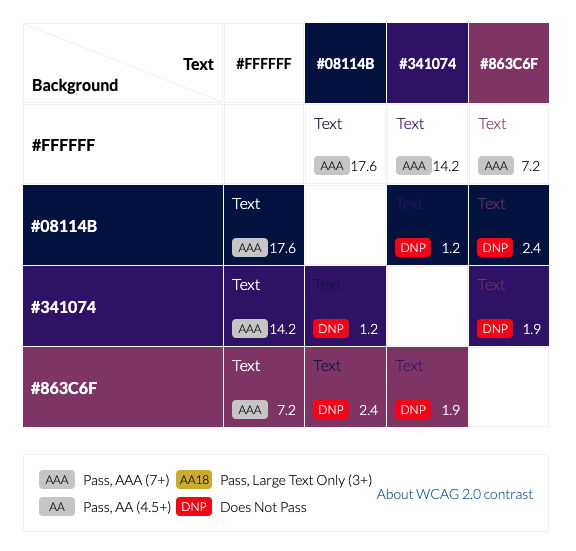
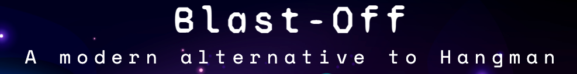

# Blast-Off - A modern alternative to hangman

This interactive front-end website has been developed to entertain space-enthusiasts whilst helping to grow and develop their space-ralated vocabulary through a challenging word-based game.

Blast-off is a modern twist on the good old fashioned, pen and paper based game Hangman.  Instead of slowly bringing an innocent stick-man to his untimely death by hanging, the user is challenged to guess a space-related word, letter-by-letter.  If the word is guessed correctly the rocket will blast-off into space, but if they get the answer wrong or run out of lives, the rocket will remain grounded.

Link to deployed site:
 
[Blast-Off - A Modern Alternative to Hangman](https://shellied.github.io/Blast-Off/)

## UX - User Experience Design
----
### The Strategy Plane
----
#### Initial Concept

This project has been developed as part of the [Code Institute's](https://codeinstitute.net/) Diploma in Full-Stack Software Development.  The aim is to create a game that will demonstrate the skills I have learnt in HTML, CSS and Javascript

My idea for this game was to create an alternative version of the traditional pen-and-paper based game Hangman.  This game was to be based on space, and use space-themed vocabulary and include a fun animation of a rocket that would 'Blast-Off' if the user guessed the word correctly, or wobbled and tobbled over if the user used all lives and did not guess the word correctly.  I wanted to create a site that could fit on one screen, despite the device used, be intuitive to use and have a fun, retro feel about it.  

The target audiece I would say, would be for children from age 6 upwards, however it is suitable for all, with families being able to sit together to play whilst tessting their spelling and increasing their space-related vocabulary.  This game could also be used in schools for topic related work and provides an opportunity for learning i.e. spelling, researching the meaning of the words generated if unknown etc.

The game could be easily adapted to fit a range of themes by simply changing the random words to be guessed, the HTML content and the colors, images and vectograms used. 

#### Site Goals

* To provide an fun, interactive game that is simple to use.
* To provide a game with varying levels of difficulty. 
* To provide options for the user to toggle sound effects on and off as they wish, where the sound is muted by default.
* To provide a fully responsive game for all device types.
* To provide an opportunity for learning.

#### User Stories

The site's strategy us based on satisfying the below user stories:

As a user:-

* I want the purpose of the game to be apparent.
* I want the game to be easy to navigate.
* I want the game to be aesthetically pleasing and styled relevant to the nature of the game.
* I want to be able to control the sound, which I would like to be muted by default.
* I would like to be able to select the difficulty level of the game.
* I want the controls to be easy to use and intuitive.
* I want to be able to keep score of the games I win and lose.
* I want to be able to reset the game.
* I want the game to be challenging.
* I want the game to have an element of fun.
* I want to be able to use the game on a wide range of devices.
* I want to be able to use a screen reader, if I need to, to help my play the game. 

### The Scope Plane
----

Features which must be included:

* Instructions on how to play the game are easy to find and undertand.
* Three levels of difficulty - easy/well-known words used for level one and more difficult/obscure words for level three.
* The game should fit the viewport of the device and no scrolling should be required.
* There should be an option to reset the game board if the user wishes to start again.
* There should be a set amount of lives to make the game more challenging.
* Increment the correct answers and the incorrect answers so the user can keep track of how many games won/lost.
* The aesthetics of the game should be visuially appealing and consistent with the space theme of the game.

Features that should be included:

* There should be an animation when the user wins or loses a game to make the game more fun to play.
* There should be sound effects to alert the user when a correct or incorrect letter has been picked and when the rocket takes off, or fails to take off.
* There should be a toggle button to all the user turn sounds on and off as desired.  This should be visible at all times throughout the game.

Features that would be nice to have:

* Display the definition or facts about the correctly guessed word to provide a learning opportunity for the user.
* A button to generate a hint to help the user the guess the word.

### The Structure Plane
----

### The Skeleton Plane
----

#### Wireframes

The below mockups were made using Balsamiq.  The design is simple but effective.  

Mobile Wireframes

Mobile Wireframes

 

 

Desktop Wireframes

 
Desktop Wireframes
 

 

### The Surface Plane
----
#### Imagery

Once satisfied with the layout and structure of the site, I got to work on sourcing a background image that would be striking, pleasing on the eye and would connect the user to the theme of the game. The below background image was found on freepik.com and was created by [Vectorpouch](https://www.freepik.com/vectors/star).  As soon as I saw this background, I knew I had to use it as it was almost exactly what I was envisaging in my mind when thinking about the overall look and feel of the game.  

#### Color Scheme

I wanted to keep the color scheme simple and so opted for plain white text to set a high colour contrast for accessability best practice and used [imagecolorpicker.com](https://imagecolorpicker.com/) to pick a deep blue background colour to use for the main container div on the page, a shade of deep purple for all buttons and a lighter purple to create differentiation when buttons are hovered over.

I used [EightShapes Contrast Grid](https://contrast-grid.eightshapes.com) to ensure that all text and background combinations used met the required contrast ratios in compliance with [WCAG 2.0 minimum contrast](https://www.w3.org/TR/UNDERSTANDING-WCAG20/visual-audio-contrast-contrast.html).

#### Typography

I wanted to give the game a science-fiction feel and what better to do that with monospaced fonts.  I used Space Mono for the main body text and buttons throughout the site and for the page heading I used Syne Mono, which gave a nod towards the 90's American science fiction drama 'The X Files'.  (Moulder and Skully would be proud!) Both were sourced from [Google Fonts](https://fonts.google.com/)

In the below screenshot of the heading, you can see how both fonts pair really nicely together.

### Features

### Existing Features

### Features Left to Implement

## Technologies Used. 

* HTML
* CSS
* JavaScipt

* 
### Gitpod Extensions???

## Testing
* W3C Validator Testing - HTML / CSS
* Wave
* JShint
* Lighthouse

I have regularly tested all aspects of the games functionality including all buttons, animations, sounds and responsiveness during the build process and have used Dev Tools in Chrome for responsivity across the following devices:-

* Galaxy S5
* Pixel 3
* Pixel 2 XL
* iPhone 5/SE
* iPhone 6/7/8
* iPhone 6/7/8 Plus
* iPhone X
* iPhone 11 Pro
* iPad
* iPad Pro
* Surface Due
* Galaxy Fold
* Nest Hub
* Nest Hub Max

I have also tested the site physically on the below devices:

* iPhone 13 pro
* iPhone 11 Pro
* Mac Book Pro 
* Dell Lattitude 5310 (Laptop)

I have also regularly tested the site using the following browsers:-

* Chrome
* Safari
* Firefox
* Edge

## Bugs
### Current Bugs
### Resolved Bugs

## Deployment
* Github Pages
* Forking

## Credits

* [FreeFormatter.com](https://www.freeformatter.com/) - I used the HTML, CSS and JavaScript Beautifiers to 

### Media

### Acknowledgments

